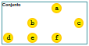
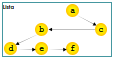
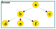
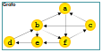

# Introdução à estrutura de dados

## Abstração

Reduz a quantidade de detalhes considerados em cada etapa da criação de um programa.

**Abstração funcional:** Permite que um programador use uma operação, sem ter que se preocupar com o detalhes de como ela é executada pelo computador.

**Abstração de dados:** Permite que um programador use um dado, sem ter que se preocupar com os detalhes de como ele é armazenado pelo computador.

## Uma estrutura de dados

É um tipo de dados abstrato que representa uma coleção de itens inter-relacionados.

### Tipos de dados abstratos

- É composto por uma coleção de dados e por um conjunto de operações.
- Para ser usado, precisa ser implementado uma linguagem de programação.

### Principais classes de estruturas de dados

**Conjuntos:** coleção de itens em que não há ordem, nem repetição.

**Lista:** coleção de itens organizados lineamente. Cada item tem um único prodecessor e um único sucessor, exceto o primeiro item, que não tem predecessor, e o último, que não tem sucessor.

**Árvore:** coleção de itens organizados hierarquicamente. Cada item em uma árvore tem um único predecessor e vários sucessores, exceto a raiz, que não tem predecessor, e as folhas, que não tem têm sucessores.

**Grafo:** coleção de itens organizados em rede. Cada item em um grafo pode ter vários predecessores e sucesssores.

